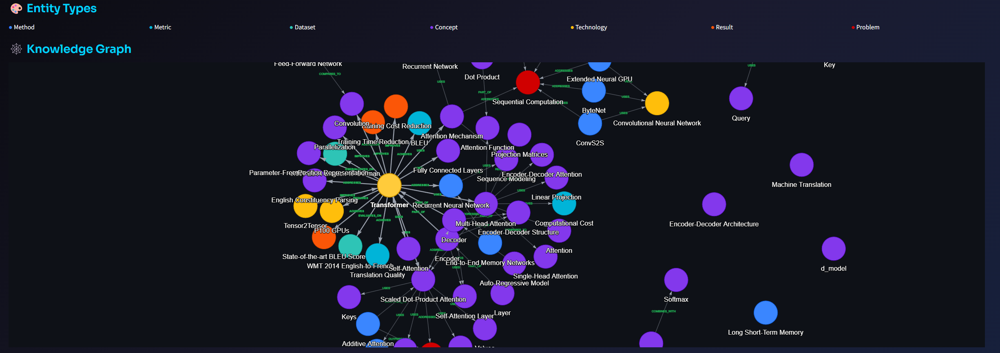

# ⚡ Axon

An AI agent that extracts **knowledge graphs** from scientific papers. Upload a PDF and get an interactive visualization of concepts, methods, datasets, and their relationships.

**Live demo:** [axon-agent.online](https://axon-agent.online)

## Why Axon?

Reading research papers is time-consuming. Axon helps you quickly understand the key entities (methods, metrics, datasets, technologies) and how they relate to each other  all visualized as an interactive graph.



## Motivation

This project started after reading Microsoft's [GraphRAG paper](https://arxiv.org/abs/2404.16130). The idea of using knowledge graphs to structure and retrieve information from documents fascinated me, so I decided to build something hands-on to explore the concept further.

## Key Libraries

- **FastAPI** — Backend API framework
- **Streamlit** — Frontend UI
- **OpenAI** — LLM for extracting entities and relationships
- **pymupdf4llm** — Converts PDFs to markdown for better LLM processing
- **LlamaIndex** — Semantic chunking of documents
- **streamlit-agraph** — Interactive graph visualization
- **Langfuse** — Prompt versioning and management

## Prompt Management with Langfuse

The system prompt that guides the LLM extraction is managed through [Langfuse](https://langfuse.com). This allows updating and iterating on the prompt without redeploying the application — just edit the prompt in Langfuse and the changes are reflected immediately.

## Running Locally

1. Clone the repository:
   ```bash
   git clone https://github.com/G0rg0ne/Axon.git
   cd Axon
   ```

2. Create a `.env` file with your API keys:
   ```
   OPENAI_API_KEY=your_openai_key
   LANGFUSE_SECRET_KEY=your_langfuse_secret
   LANGFUSE_PUBLIC_KEY=your_langfuse_public
   ```

3. Run with Docker:
   ```bash
   docker compose -f docker-compose.prod.yml up --build
   ```

Access the app at `http://localhost:8501`

## License

MIT License - see [LICENSE](LICENSE) for details.

---

Made by [Gorgone](https://github.com/G0rg0ne)
